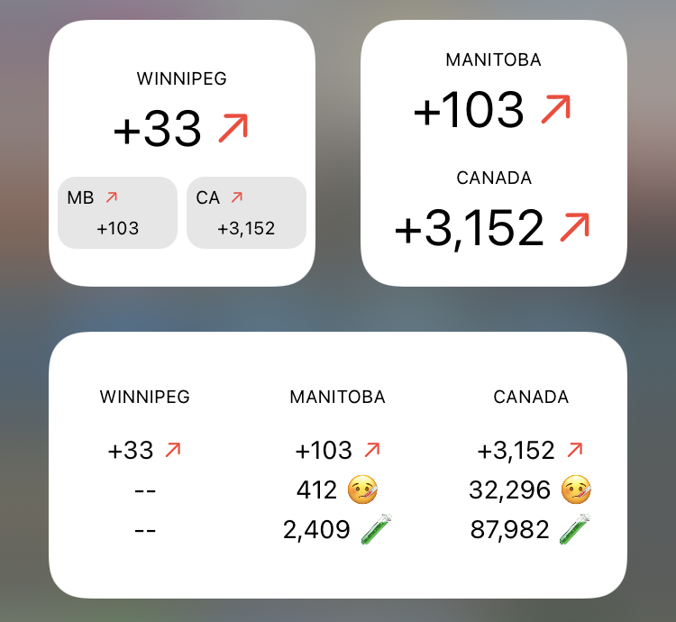
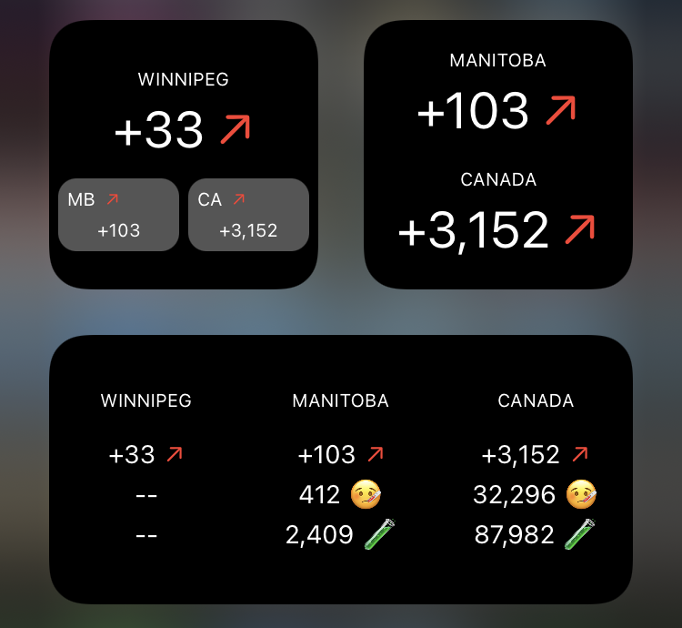

# COVID-19 Widget Canada 🇨🇦

This script creates a custom iOS widget using [Scriptable](https://scriptable.app) showing COVID-19 stats for a specific health region, province and all of Canada.

The small widget shows new cases for a specific health region, province and all of Canada.
The medium widget shows new cases, active cases and tests taken that day for a specific health region, province and all of Canada.

A trend indicator shows today's new cases in comparison to last week's new cases.

The region can be set through the widget parameter or through constants in the code by either providing a health region code or a the two-letter province code.

The data is taken unaltered from the [COVID-19 Canada Open Data Working Group](https://opencovid.ca) – only the trend indicator is added. The data is cached for when device is offline.

The widgets support dark mode and the appearance can be configured in the code. By default the appearance of the widgets change with the appearance of the device.

## Installation

1. Download [Scriptable](https://apps.apple.com/de/app/scriptable/id1405459188) from the App Store.
1. Copy the code from [covid19-widget-canada.js](covid19-widget-canada.js).
1. Open Scriptable and add a new script.
1. Edit the name of the script, paste the code and tap 'Done'.
1. Go to your home screen and add a new Scriptable widget.
1. Select this script and enter the health region code (e.g. '4601') or the two-letter province code (e.g. 'MB') in 'Parameter'.

The respective health region code can be found at [https://opencovid.ca/api/#health-region-codes](https://opencovid.ca/api/#health-region-codes).

## To-Do

- [ ] Detect health region code automatically
- [ ] Deal with missing reports on weekends
- [x] Cache data for when offline
- [ ] Show test positivity rate
- [x] Utilize medium widget
- [ ] Utilize large widget

## Credits

* [CCODWG](https://opencovid.ca) for the data and the API
* @rphl for the inspiration with [corona-widget](https://github.com/rphl/corona-widget)
* @kevinjalbert for the ground-breaking work on his [script](https://gist.github.com/kevinjalbert/275590b53f8d6b06c5703fad549099f9)
