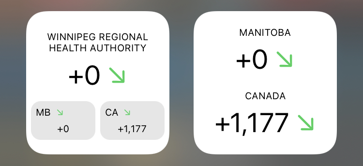

# COVID-19 Widget 🇨🇦

This script creates a custom iOS widget using [Scriptable](https://scriptable.app) showing daily new cases in health region, province and country.

A trend indicator shows today's new cases in comparison to last week's new cases.

The region can be set through widget parameter or through constants in the code by either providing a health region code or a the two-letter province code.

The data comes from [COVID-19 Tracker Canada](https://covid19tracker.ca).

The widget also supports dark mode.

## Installation

1. Download [Scriptable](https://apps.apple.com/de/app/scriptable/id1405459188) from the App Store.
1. Copy the code from [covid19-widget-canada.js](covid19-widget-canada.js).
1. Open Scriptable and add a new script.
1. Edit the name of the script, paste the code and tap 'Done'.
1. Go to your home screen and add a new Scriptable widget.
1. Select this script during configuration of this widget.
1. Enter the health region code (e.g. '4601') or the two-letter province code (e.g. 'MB') in 'Parameter'.

The respective health region code can be found at [https://opencovid.ca/api/#health-region-codes](https://opencovid.ca/api/#health-region-codes).

## To-Do

- [ ] Detect health region code automatically
- [ ] Cache data for when offline
- [ ] Show test positivity rate
- [ ] Utilize medium widget
- [ ] Utilize large widget

## Credits

* @andrewthong for the data and the [API](https://github.com/andrewthong/covid19tracker-api)
* @rphl for the inspiration with [corona-widget](https://github.com/rphl/corona-widget)
* @kevinjalbert for the ground-breaking work on his [script](https://gist.github.com/kevinjalbert/275590b53f8d6b06c5703fad549099f9)
